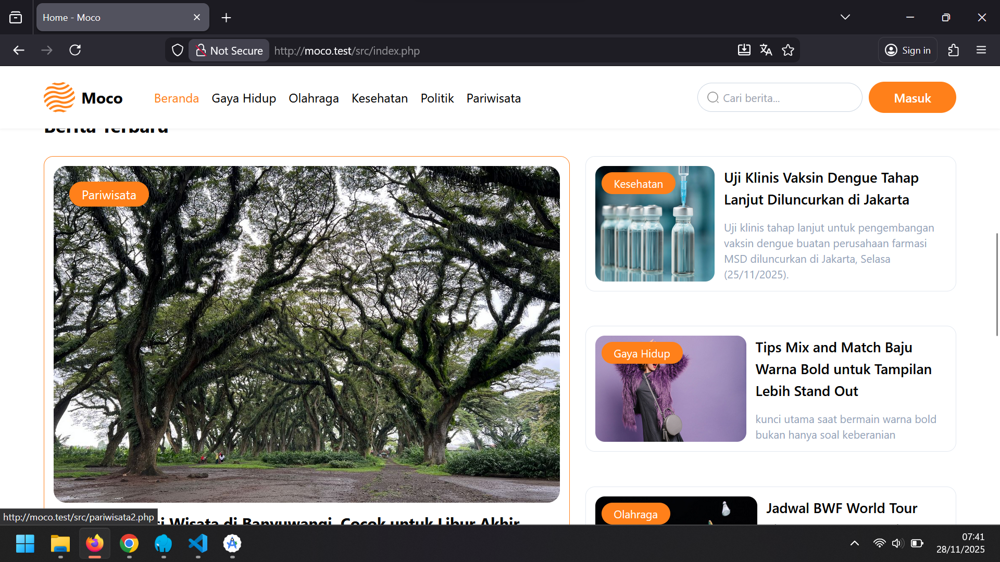

📰 Portal Berita — Informasi Cepat, Akurat, dan Selalu Update
Portal Berita ini adalah aplikasi web yang dirancang untuk menyajikan informasi terbaru dari berbagai kategori secara cepat dan mudah diakses.
Dengan tampilan yang modern, simple, dan responsif, pengguna dapat menikmati pengalaman membaca berita yang lebih nyaman dan terstruktur.
Aplikasi ini menyajikan berita dari kategori politik, kesehatan, olahraga, gaya hidup, dan berbagai topik menarik lainnya. 
Semua konten ditampilkan dengan layout yang bersih dan rapi agar pembaca fokus pada informasi yang disampaikan.
✨ Fitur Utama
📰 1. Halaman Berita Utama (Landing Page)
Menampilkan berita terbaru dan berita unggulan dengan tampilan hero section yang menarik.

  

