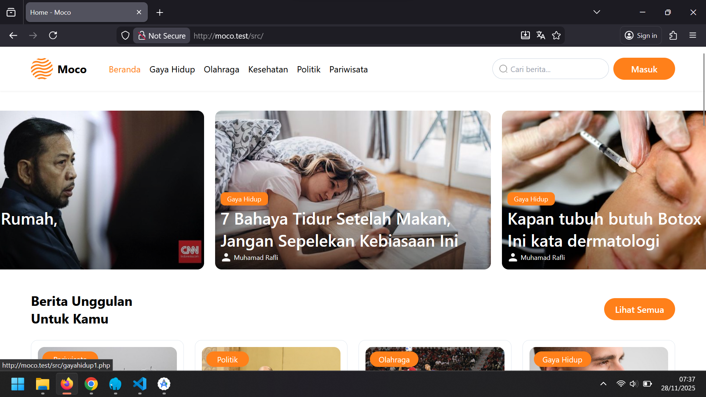
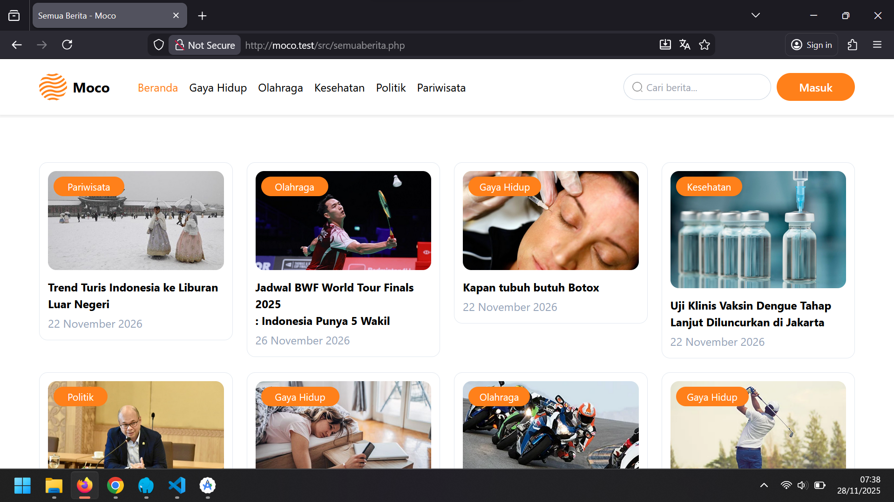
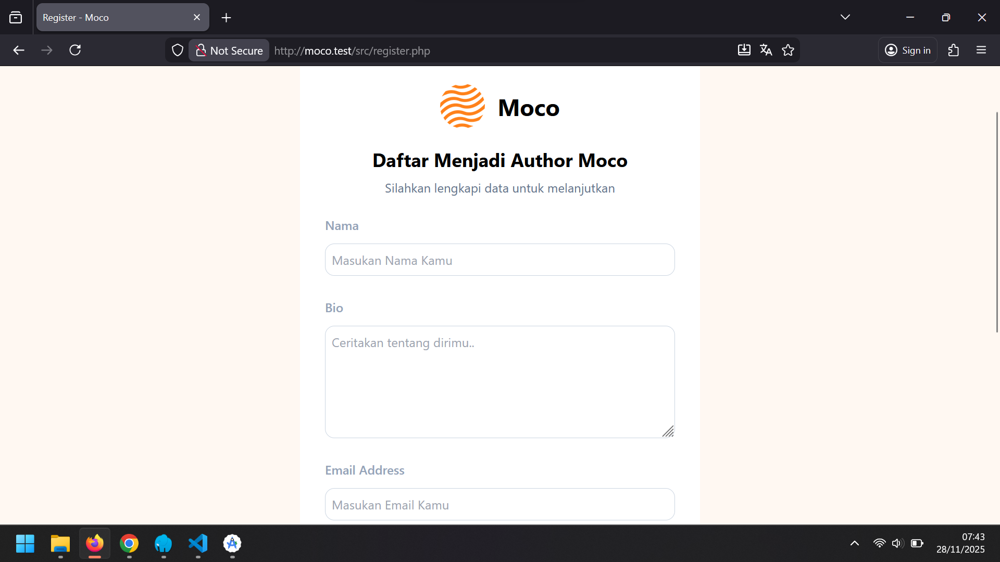
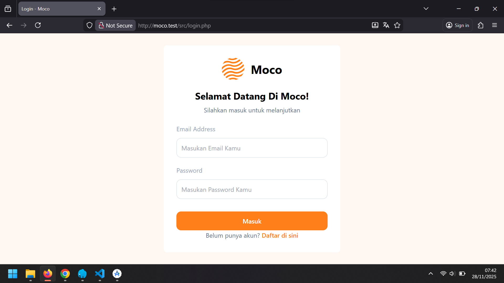

📰 Portal Berita — Informasi Cepat, Akurat, dan Selalu Update
Portal Berita ini adalah aplikasi web yang dirancang untuk menyajikan informasi terbaru dari berbagai kategori secara cepat dan mudah diakses.
Dengan tampilan yang modern, simple, dan responsif, pengguna dapat menikmati pengalaman membaca berita yang lebih nyaman dan terstruktur.
Aplikasi ini menyajikan berita dari kategori politik, kesehatan, olahraga, gaya hidup, dan berbagai topik menarik lainnya. 
Semua konten ditampilkan dengan layout yang bersih dan rapi agar pembaca fokus pada informasi yang disampaikan.

✨ Fitur Utama

📰 1. Halaman Berita Utama (Landing Page)
Menampilkan berita terbaru dan berita unggulan dengan tampilan hero section yang menarik.

  

🗞️ 2. Kategori Berita Lengkap

Pengguna dapat memilih kategori seperti politik, olahraga, gaya hidup, kesehatan, dan lainnya.

  

👥 4. Halaman Daftar Author

Menampilkan informasi author yang menulis berita, lengkap dengan foto dan deskripsi.

  

🔐 5. Halaman Login

Fitur login untuk admin guna mengelola berita secara efisien.

  

⚙️ Teknologi yang Digunakan

PHP Native (tanpa framework)

MySQL untuk basis data

HTML5 & CSS3

JavaScript

🎯 Tujuan Project

Portal Berita ini dibuat untuk menyediakan platform berita yang cepat, responsif, dan mudah dikelola.
Sistem ini cocok untuk proyek tugas, portofolio, maupun pengembangan portal berita skala kecil hingga menengah.

